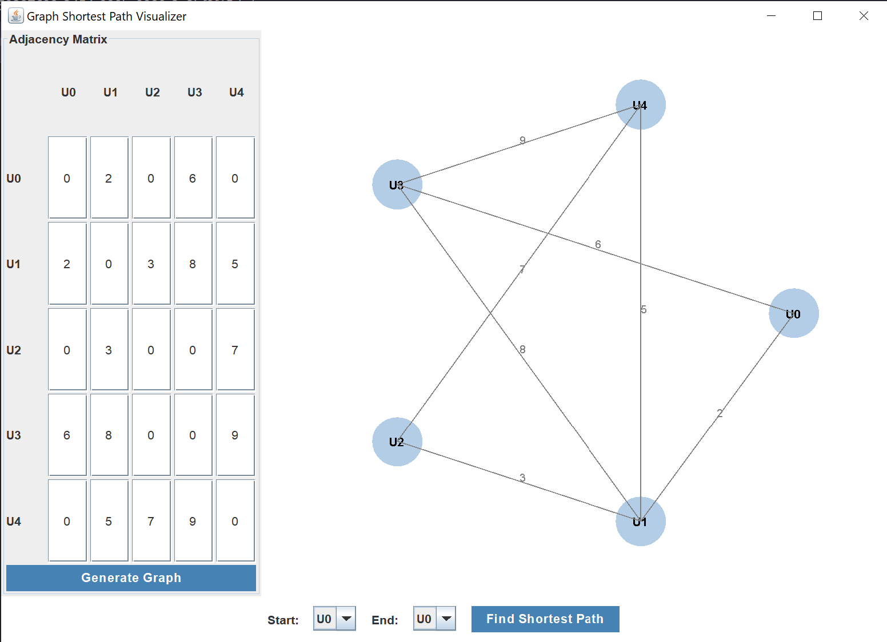
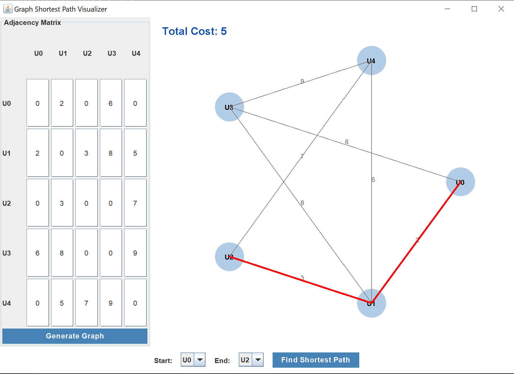

# Graph Shortest Path Visualizer 🗺️

A Java Swing application that visualizes Dijkstra's shortest path algorithm on user-defined graphs.

## Features

- 🖥️ Interactive GUI for graph input
- 🔢 Customizable adjacency matrix
- 🎨 Circular graph visualization
- 🔍 Shortest path highlighting
- 📊 Edge weight display
- 🏁 Start/end node selection

## Algorithm Used

```bash
private void calculateShortestPath(int start, int end) {
    int[] dist = new int[size];
    boolean[] visited = new boolean[size];
    int[] prev = new int[size];

    Arrays.fill(dist, Integer.MAX_VALUE);
    dist[start] = 0;

    for (int i = 0; i < size; i++) {
        int u = getMinDistNode(dist, visited);
        for (int v = 0; v < size; v++) {
            if (adjacencyMatrix[u][v] > 0) {
                int alt = dist[u] + adjacencyMatrix[u][v];
                if (alt < dist[v]) {
                    dist[v] = alt;
                    prev[v] = u;
                }
            }
        }
    }
    // Path reconstruction...
}
```

## How to Run

1. **Run the application**:

   ```bash
   javac GraphShortestPathGUI.java
   java GraphShortestPathGUI
   ```

2. **Set up your graph**:

   - Enter number of nodes (users)
   - Fill in the adjacency matrix (0 = no edge)
   - Click "Generate Graph"

3. **Find shortest path**:
   - Select start and end nodes
   - Click "Find Shortest Path"
   - View highlighted path and total cost

## Example Output



